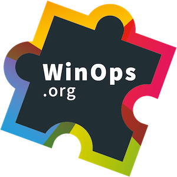

@title[Managing Organizational Use Of Chocolatey]

## Managing Organizational Use Of Chocolatey
### Best practices for setting up and using Chocolatey within your Organization

---

@title[Who Am I? - Gary Ewan Park]
@transition[none]

@snap[north-west]
@css[choco-blue](WHO AM I?)
@snapend

@snap[west span-65]
Senior Software Engineer @ Chocolatey Software
 
 

@snapend

@snap[east span-30]

 
@css[bio-name](Gary Ewan Park)
@snapend

@snap[south-west bio-contact]
@fa[twitter twitter-blue]&nbsp;&nbsp;gep13&nbsp;&nbsp;&nbsp;&nbsp;&nbsp;
@fa[github text-black]&nbsp;&nbsp;github.com/gep13&nbsp;&nbsp;&nbsp;&nbsp;&nbsp;
@fa[home text-blue]&nbsp;&nbsp;gep13.co.uk&nbsp;&nbsp;&nbsp;&nbsp;&nbsp;
@fa[envelope choco-blue]&nbsp;&nbsp;gary@chocolatey.io
@snapend

+++

@title[Who Am I? - Paul Broadwith]
@transition[none]

@snap[north-west]
@css[choco-blue](WHO AM I?)
@snapend

@snap[west span-65]
Senior Technical Engineer @ Chocolatey Software
 
 
25+ years in IT
 

@snapend

@snap[east span-30]

 
@css[bio-name](Paul Broadwith)
@snapend

@snap[south-west bio-contact]
@fa[twitter twitter-blue]&nbsp;&nbsp;pauby&nbsp;&nbsp;&nbsp;&nbsp;&nbsp;
@fa[github text-black]&nbsp;&nbsp;github.com/pauby&nbsp;&nbsp;&nbsp;&nbsp;&nbsp;
@fa[home text-blue]&nbsp;&nbsp;pauby.com&nbsp;&nbsp;&nbsp;&nbsp;&nbsp;
@fa[envelope choco-blue]&nbsp;&nbsp;paul@chocolatey.io
@snapend

---

@title[Agenda]
@transition[none]

@snap[north-west]
@css[choco-blue](Agenda)
@snapend

@title[Agenda]
@transition[none]

@snap[north-west]
@css[choco-blue](Agenda)
@snapend

@snap[west]
@ul

* 13:30: Workshop Starts
* 15:00: Coffee Break
* 17:00: Workshop Ends

@ulend
  
Please feel free to interrupt for any questions that you might have.
@snapend

+++

@title[Agenda]
@transition[none]

@snap[north-west]
Agenda
@snapend

@snap[west]
@ul

* Get access to workshop environments
* Chocolatey fundamentals
* Configuring package repositories
* Using Chocolatey self-service
* How to use Chocolatey sync command
* Combining Chocolatey and Configuration Management
* Chocolatey Central Management

@ulend
@snapend

---

@title[Pre-Requisites]
@transition[none]

@snap[north-west]
@css[choco-blue](Pre-Requisites)
@snapend

@snap[west]
@ul
- Computer with network connection and RDP client
  - on Windows, you are probably all set
  - on macOS, get Microsoft Remote Desktop from the App Store
  - on Linux, get [remmina](https://wiki.ubuntuusers.de/remmina/)
- Some Chocolatey knowledge
  - but it's OK if you are not a Chocolatey expert!
@ulend
@snapend
