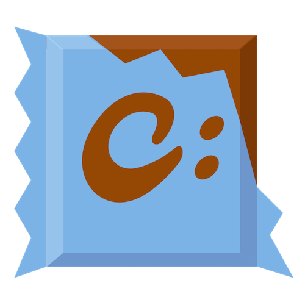
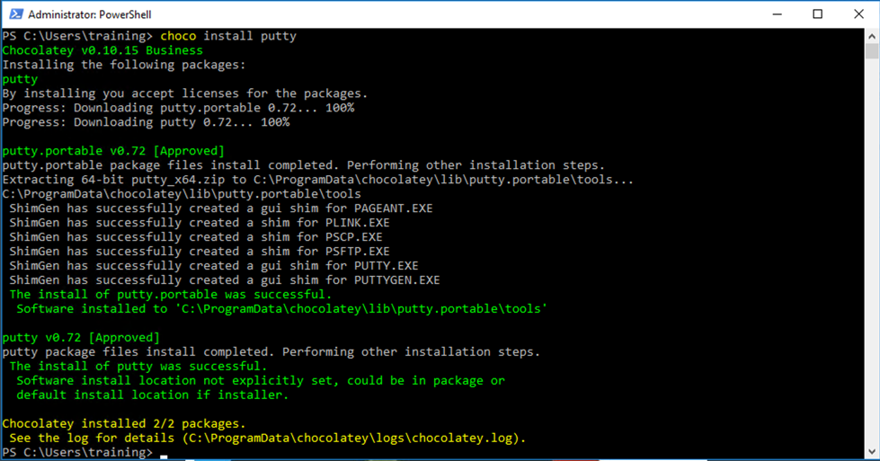

@title[Managing Organizational Use Of Chocolatey]

## Managing Organizational Use Of Chocolatey
### Best practices for setting up and using Chocolatey within your Organization

---

@title[Who Am I? - Gary Ewan Park]
@transition[none]

@snap[north-west]
@css[choco-blue](WHO AM I?)
@snapend

@snap[west span-65]
Senior Software Engineer @ Chocolatey Software
 
 

@snapend

@snap[east span-30]

 
@css[bio-name](Gary Ewan Park)
@snapend

@snap[south-west bio-contact]
@fa[twitter twitter-blue]&nbsp;&nbsp;gep13&nbsp;&nbsp;&nbsp;&nbsp;&nbsp;
@fa[github text-black]&nbsp;&nbsp;github.com/gep13&nbsp;&nbsp;&nbsp;&nbsp;&nbsp;
@fa[home text-blue]&nbsp;&nbsp;gep13.co.uk&nbsp;&nbsp;&nbsp;&nbsp;&nbsp;
@fa[envelope choco-blue]&nbsp;&nbsp;gary@chocolatey.io
@snapend

+++

@title[Who Am I? - Paul Broadwith]
@transition[none]

@snap[north-west]
@css[choco-blue](WHO AM I?)
@snapend

@snap[west span-65]
Senior Technical Engineer @ Chocolatey Software
 
 
25+ years in IT
 

@snapend

@snap[east span-30]

 
@css[bio-name](Paul Broadwith)
@snapend

@snap[south-west bio-contact]
@fa[twitter twitter-blue]&nbsp;&nbsp;pauby&nbsp;&nbsp;&nbsp;&nbsp;&nbsp;
@fa[github text-black]&nbsp;&nbsp;github.com/pauby&nbsp;&nbsp;&nbsp;&nbsp;&nbsp;
@fa[home text-blue]&nbsp;&nbsp;pauby.com&nbsp;&nbsp;&nbsp;&nbsp;&nbsp;
@fa[envelope choco-blue]&nbsp;&nbsp;paul@chocolatey.io
@snapend

---

@title[Agenda]
@transition[none]

@snap[north-west]
@css[choco-blue](Agenda)
@snapend

@title[Agenda]
@transition[none]

@snap[north-west]
@css[choco-blue](Agenda)
@snapend

@snap[west]
@ul

* 09:00: Workshop Starts
* 10:30: Coffee Break
* 12:30: Workshop Ends

@ulend
  
Please feel free to interrupt for any questions that you might have.
@snapend

+++

@title[Agenda]
@transition[none]

@snap[north-west]
Agenda
@snapend

@snap[west]
@ul

* Get access to workshop environments
* Chocolatey fundamentals
* Configuring package repositories
* Using Chocolatey self-service
* How to use Chocolatey sync command
* Combining Chocolatey and Configuration Management
* Chocolatey Central Management

@ulend
@snapend

---

@title[Pre-Requisites]
@transition[none]

@snap[north-west]
@css[choco-blue](Pre-Requisites)
@snapend

@snap[west]
@ul

* Computer with network connection and RDP client
  * on Windows, you are probably all set
  * on macOS, get Microsoft Remote Desktop from the App Store
  * on Linux, get [remmina](https://wiki.ubuntuusers.de/remmina/)
* Some Chocolatey knowledge
  * but it's OK if you are not a Chocolatey expert!
@ulend
@snapend

+++

@title[Hands-on Sections]
@transition[none]

@snap[north-west]
@css[choco-blue](Hands-on Sections)
@snapend

@snap[north span-100]
  
@ul

* Uses Chocolatey 0.10.15
* All hands-on section are clearly identified, like the rectangle below:

@ulend
@snapend

@snap[south exercise-box]

@fa[keyboard-o]()&nbsp;Exercise
 
@ul

* This is the stuff you are supposed to do!
* Go to [this url](https://gitpitch.com/chocolatey/chocolatey-workshop-organizational-use/master) to view these slides.

@ulend
@snapend

+++

@title[Terminals]
@transition[none]

@snap[north-west]
@css[choco-blue](Terminals)
@snapend

Once in a while, the instructions will say:

@quote[Open a new terminal]

This needs to be an Administrator session.

* Press [Windows], type `powershell`, right click on entry and select `Run as Administrator`

+++

@title[Test RDP Access]
@transition[none]

@snap[north-west]
@css[choco-blue](Test RDP Access)
@snapend

You should have been given a piece of paper like this:

Test login credentials to make sure you have access.

**NOTE:** Initial login will likely cause a reboot of VM.

---

## Chocolatey Fundamentals

+++

@title[What is Chocolatey?]

## What is Chocolatey?

+++

@title[A Definition...]

### A Definition...

@quote[Chocolatey allows you to deploy any Windows software, anywhere, with anything, and manage and track that software over time.](Rob Reynolds - Creator of Chocolatey)

+++

#### Chocolatey is a package manager for Windows

+++

#### Similar to apt-get, yum, and Homebrew

+++

### With Chocolatey you can...

* Manage ANY software, not just installers
* Define dependencies
* Write a software deployment one time (with PowerShell)
* Test your deployment before deploying to Production
* Deploy to any supported version of Windows (including Server.Core and Docker Containers)
* Track and Report on software

+++?image=assets/images/magic.gif&size=45% auto&color=#A74433

@title[It's Magic!]

---

## How does Chocolatey work?

+++

@title[Let's install paint.net]

## Let's install paint.net...

+++

@title[paint.net website]

<!-- .slide: data-transition="none" -->

+++

@title[Not the paint.net website]

<!-- .slide: data-transition="none" -->

+++

@title[Google paint.net]

<!-- .slide: data-transition="none" -->

+++

@title[Actual paint.net website]

<!-- .slide: data-transition="none" -->

+++

@title[paint.net download]

<!-- .slide: data-transition="none" -->

+++

@title[Mirror website]

<!-- .slide: data-transition="none" -->

+++

@title[Actual paint.net download]

<!-- .slide: data-transition="none" -->

+++

@title[Unblock zip file]

<!-- .slide: data-transition="none" -->

+++

@title[Extract zip file]

<!-- .slide: data-transition="none" -->

+++

@title[Install paint.net]

<!-- .slide: data-transition="none" -->

+++

@title[paint.net dependencies]

<!-- .slide: data-transition="none" -->

+++

@title[There has to be a better way!]

## @fa[quote-left] There has to be a better way!

+++

@title[Chocolatey]

---

## Install putty

@snap[center exercise-box]

@fa[keyboard-o]()&nbsp;Exercise
 

<pre><code class="lang-powershell hljs">choco install putty</code></pre>

@snapend

+++

## Result

---

# Sources

TODO: Need to add some information here about Nexus

+++

## Sources

What is a Chocolatey Source?

+++

## List current Sources

@snap[center exercise-box]

@fa[keyboard-o]()&nbsp;Exercise
 

<pre><code class="lang-powershell hljs">choco sourcechoco source list</code></pre>

@snapend

+++

## Result

+++

## Add Test Repository Source

+++

## Result

+++

## Add Production Repository Source

---

@title[Questions]
## Questions?

Feel free to get in touch after the workshop.

Email: gary@chocolatey.io / paul@chocolatey.io

Twitter: @gep13 / @pauby

Web: https://chocolatey.org

---

@title[Resources]
## Resources

* Chocolatey Documentation - https://chocolatey.org/docs
* Gitter Chat - https://gitter.im/chocolatey/choco
* Google Groups - https://groups.google.com/forum/#!forum/chocolatey
* Learning Resources - https://chocolatey.org/docs/resources
