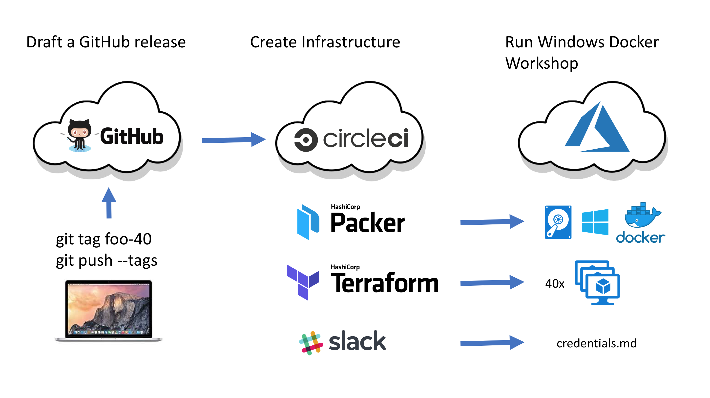

# Prepare VM's for the workshop

You can prepare the Windows Server 2016 VM's with one of these Terraform templates.

- Azure

## Full automated build

We've implemented a fully automated build to run a Chocolatey Internalizer Workshop very easily.

- Draft a new GitHub release
  - The tag name is `foo-40` to create 40 VM's with DNS prefix `foo`.
- CircleCI build is triggered
- A previous Packer build created a VM image with Docker and Tools.
- A Terraform build creates the 40 VM's with random passwords.
- A Slack notification is sent with all credentials.
- Print the credentials for each attendee and run the workshop :-)

## Pre-requisites

In order to run this build locally, you will need the following things installed:

* jq
  * `brew install jq`
* azure cli
  * `brew install azure-cli`
* packer
  * `brew install packer`
* terraform
  * `brew install terraform`
* atom
  * `brew cask install atom`
* pwgen
  * `brew install pwgen`
